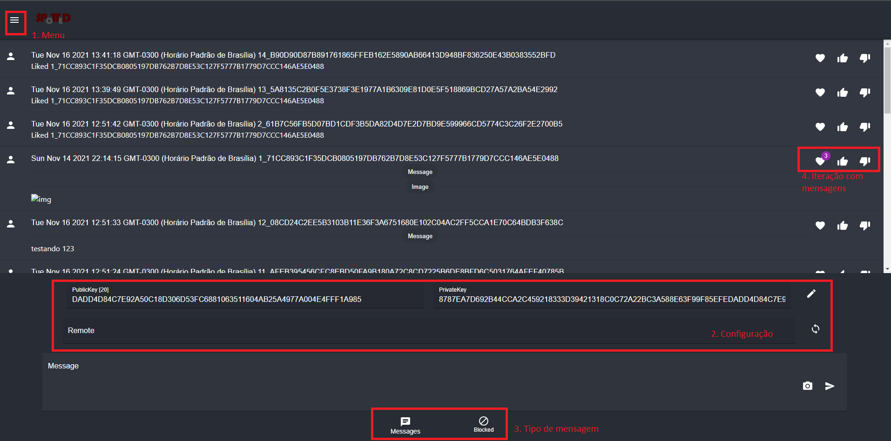
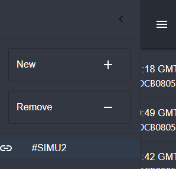

# Spotted

Todo o trabalho prático pode ser encontrado nos sequintes links:
 - [Funcionamento do backend](backend/README.md)
 - [Funcionamento do frontend](frontend/README.md)
 - [Simulação do freechains em cima do Spotted](simu/README.md)

## Trabalho

Crie uma aplicação P2P usando o sistema de reputação do Freechains:
1. Qual é o objetivo da aplicação?
2. Que outras funcionalidades do Freechains a aplicação tira proveito?
3. Descreva o funcionamento esperado da aplicação.
    1. Como os usuários devem interagir.
    2. Como o sistema de reputação deve pautar a interação entre os usuários.
        - Esse item pode ser inteiramente substituído pela Pergunta #4.
4. Implemente um protótipo da aplicação.
    1. Descreva exatamente o que será implementado.
    2. Descreva exatamente o que *não* será implementado.
    3. Enumere as ferramentas utilizadas para a implementação.
    4. Poste o código no GitHub.

## Desenvolvimento da aplicação

Foi criado a aplicação de nome Spotted para simular os grupos de spotted do facebook em cima de um serviço P2P LSF ([freechains](https://github.com/Freechains/README)).

Para o desenvolvimento do backend foi usado servidor em Flask do python e para o frontend usado ReactJS+Material UI.

Toda a aplicação foi desenvolvida em cima do docker para encapsular e conseguir simular de forma mais fiel um comportamento P2P sendo que cada container possui um IP diferente numa mesma subrede simulada pelo próprio docker.

## Objetivo

O objetivo desta aplicação é funcionar como um dos grupos de spotted que vemos no facebook. Com ele cada Cadeia é um local, por exemplo, UERJ ou UERJ-4andar. Em cada um destes tópicos as pessoas conversam e postam fotos de pessoas que elas desejam saber quem é ou fazer algum tipo de comentário.

Essa aplicação foi pensada porque flui muito bem em um serviço P2P e com o protocolo desenvolvido no Freechains não seria necessário nada extra para o desenvolvimento da aplicação.

## Funcionalidades do Freechains usada

Foram utilizados quase todas as funcionalidades do freechains, exceto:
 - Peer Ping: Não foi necessário verificar a conectividade com o peer, caso a sincronização dê errado é acusado.
 - Peer Chains: Não foi implementado busca de cadeias, até porque não conseguimos visualizar as chaves publicas das cadeias de outros peers para entrar.
 - Host Now: para a aplicação não é necessário usar a rota para mudar o tempo atual, muito útil para a simulação

Quanto à logica de funcionamento do freechains, usamos sua forma de consenso para realizar o merge das cadeias e garantir a reputação correta para cada post e usuário. De forma que seja impossível para o usuário burlar o sistema, como reputação infinita. Esse tipo de funcionalidade permite que a utilização de um sistema colaborativo P2P seja muito mais fluido do que o próprio usuário realizar o merge da cadeia localmente ou até mesmo ter um servidor centralizado para reputação, pois seria extremamente dificil garantir a contagem de reputação na aplicação de uma forma diferente da garantida pelo freechains com o consenso da cadeia de blocos.

## Funcionamento da aplicação

### Interação entre usuários

A ideia é os usuários interagirem através de postagem de mensagens que podem ter mensagem e uma imagem ou realizando replies (com like ou dislike) além dos likes e dislikes puros. Conforme o conteúdo da cadeia estiver conforme as regras, o pioneiro e depois a própria comunidade realiza likes para incentivar esse tipo de conteúdo, já os conteúdos fora da regra é deve ser preferencialmente dado dislike para que a mensagem caia na regra do freechains e evite que ela continue se espalhando pela rede.

No sistema mostra mensagens bloqueadas que são de usuários novos ou de usuários sem reputação e estes devem seguir as mesma regras de conteúdo que das mensagens liberadas, com a diferença que uma mensagem bloqueada de conteúdo impróprio nunca aparecerá na cadeia principal.

Toda a interação dos usuários é realizada em cima da interface frontend que existirá em cada nó local, conforme as imagens no item `Prótotipo`

### Sistema de reputação

O sistema de reputação vai guiar o percurso daquela cadeia na comunidade, seguindo as seguintes regras bases:
 - Toda mensagem pode receber like e dislike sem comentário(why)
 - Toda sistema de reply é utilizando o sistema de like e deslike, sendo a própria mensagem o why
 - Uma mensagem com muitos likes é considerada viral e é facilmente identificada pelos badgets acima do ícone de coração em cada mensagem
 - Para saber qual mensagem é de like, basta procurar uma mensagem com o formato 'Liked hash'
 - Mensagens com muitos deslikes são removidos da cadeia pelo protocolo freechains
 - Mensagem com dislike do próprio usuário que mandou, é revogada
 - O usuário precisa ter ao menos 1 de reputação para postar uma mensagem na cadeia sem precisar que seja desbloqueado
 - O usuário pode ter até 30 reputações, então é desejável que utilize
 - Para saber a quantidade de reputação de um usuário, ou coloque a chave publica escrita no textedit ou coloque o mouse acima da imagem do usuário na mensagem.
 - Usuários com maior quantidade de reputação são considerados pessoas com conteúdos que seguem as regras

## Protótipo

O protótipo foi desenvolvido e para levantar o servidor basta seguir os passos que se encontram [aqui](frontend/README.md)

### Tela principal

1. Botão para abrir o menu lateral onde é realizado a seleção de cadeia, criação e remoção
2. Região de configuração que mostra os campos para colocar o usuário corrente que está utilizando (Chave privada e publica), com o botão com lápis para gerar uma nova chave. Também possui a parte para colocar o endereço remoto de outro servidor para sincronização de cadeias.
3. Menu em que selecionados o tipo de mensagem que desejamos visualizar.
4. Interação em cada mensagem, que mostra a quantidade de likes a mensagem possui e um botão para curtir(like) e não curtir(dislike)

### Menu Lateral

No menu lateral temos uma caixa de texto para criar e remover cadeias, ignorando o '#' pois todas as cadeias da aplicação serão publicas.

Também temos uma lista de cadeias registradas no nó, para ver as mensagens delas basta selecioná-las na lista.

### O que foi implementado

1. Interface gráfica para visualização e interação com o sistema
2. Possibilidade de se juntar ou sair de uma cadeia, desde que já tenha descoberto em outro local
3. Possibilidade de enviar mensagens e upar fotos para a cadeia selecionada
4. Possibilidade de dar likes e dislikes para mensagens na cadeia
5. Possibilidade de visualizar quantidade de likes uma mensagem possui
6. Possibilidade de descobrir a quantidade de reputação cada usuário possui na rede
7. Possibilidade de sincronizar cadeias com outro servidor
8. Possibilidade de utilizar um par de chaves existentes ou criar um novo

### O que não foi implementado

1. Possibilidade de descoberta de cadeias de forma automática
2. Possibilidade de reply de mensagens encadeada na própria mensagem
3. Sincronização com mais de um peer por vez
4. Guardar chaves geradas no nó de forma segura

### Ferramentas utilizadas no desenvolvimento

1. Docker
2. Freechains
3. Flask em python
4. ReactJS e Material UI (javascript, HTML e CSS)

